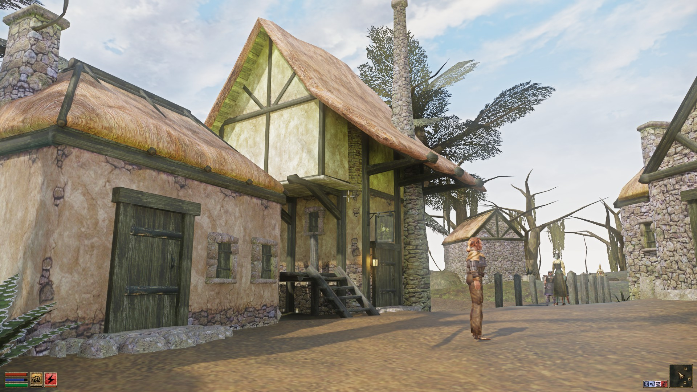
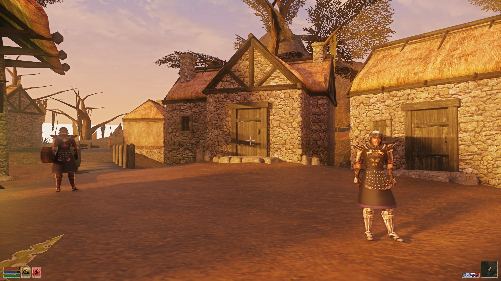
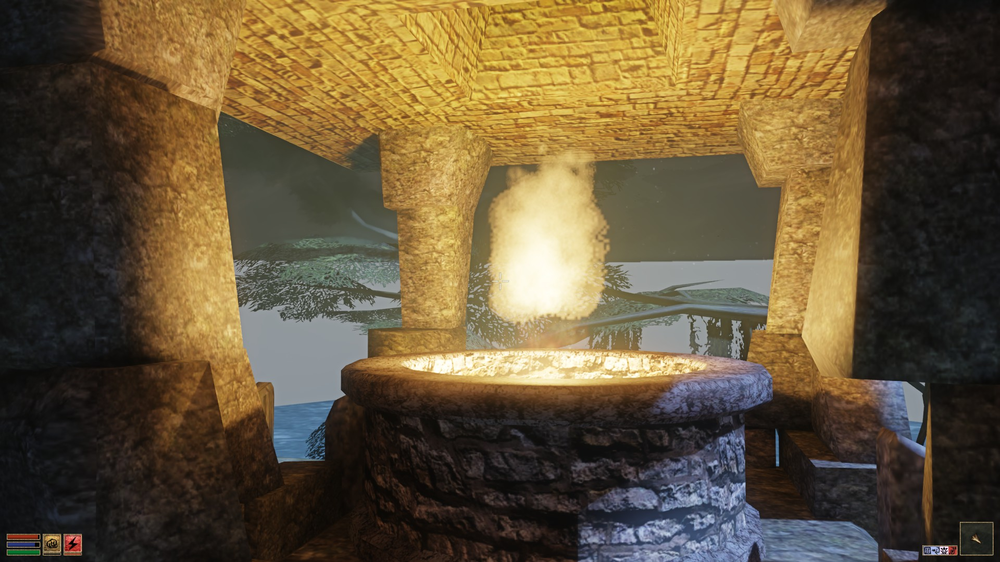

# RTX Remix Morrowind config

A repository for the RTX Remix config files to use with Morrowind.

## Installation

1. Install Morrowind (GOG / Steam), use no mods such as MGE XE or MWSE.
2. Unpack the latest [RTC Remix Release](https://github.com/NVIDIAGameWorks/rtx-remix/releases) to the Morrowind folder.
3. Unpack [dxwrapper_dx8](https://cdn.discordapp.com/attachments/1055002970091176006/1096142373609811978/dxwrapper_dx8.7z) to the Morrowind folder.
4. Add [rtx.conf](./rtx.conf) file to the Morrowind folder.
5. Set the game into windowed mode.
6. Launch the game.
7. Use Alt + X to open Remix Overlay

**Hint**: Since cursor is [not visible in Overlay](https://github.com/NVIDIAGameWorks/rtx-remix/issues/67), as a workaround you can enable
"Show location of the pointer when I press the CTRL key" in Mouse Properties.

## Demo:

[Short  video on YT](https://www.youtube.com/watch?v=AuWWIhFVWQg)

### Credits

- Kim#9859 for dxwrapper_dx8.

[Join official discord](https://discord.gg/VgG6SZFtaX) and check [Morrowind thread](https://discord.com/channels/1028444667789967381/1097049994156060682) there.